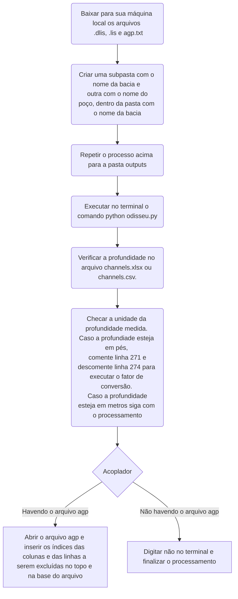

# Odisseia
Investigação metodológica para a análise de dados de um dlis.

O objetivo deste repositório é explorar o conteúdo de um arquivo DLIS associado à um poço específico. Note que o objetivo é "casar" os dados do DLIS com o conteúdo da tabela de dados geoquímicos `exemplo Tabela poço 7-PIR-184D-AL.xlsx`. 

Como referência, utilize o documento em https://towardsdatascience.com/loading-well-log-data-from-dlis-using-python-9d48df9a23e2

e o manual de referência https://dlisio.readthedocs.io/en/latest/

## Dados de poços do CPRM:
Neste site encomtram-se apenas as bacias terrestres: https://reate.cprm.gov.br/

## Metodologia

Para que o programa odsseu.py funcione de acordo como ele foi concebido é necessário seguir os passos da metodologia abaixo

